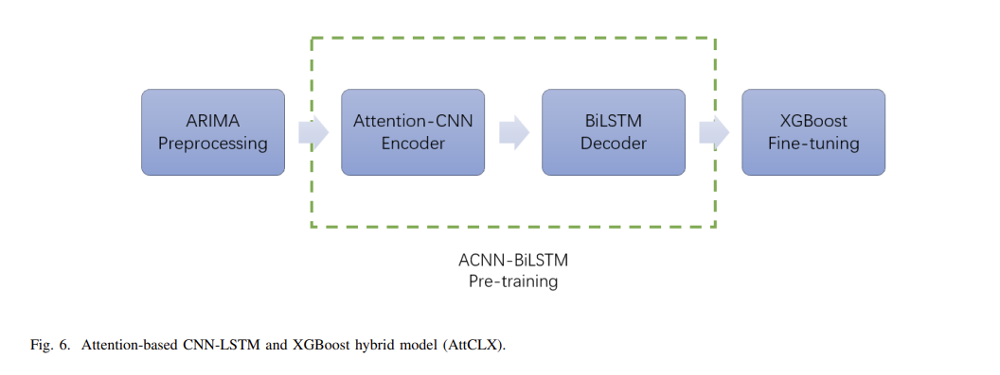
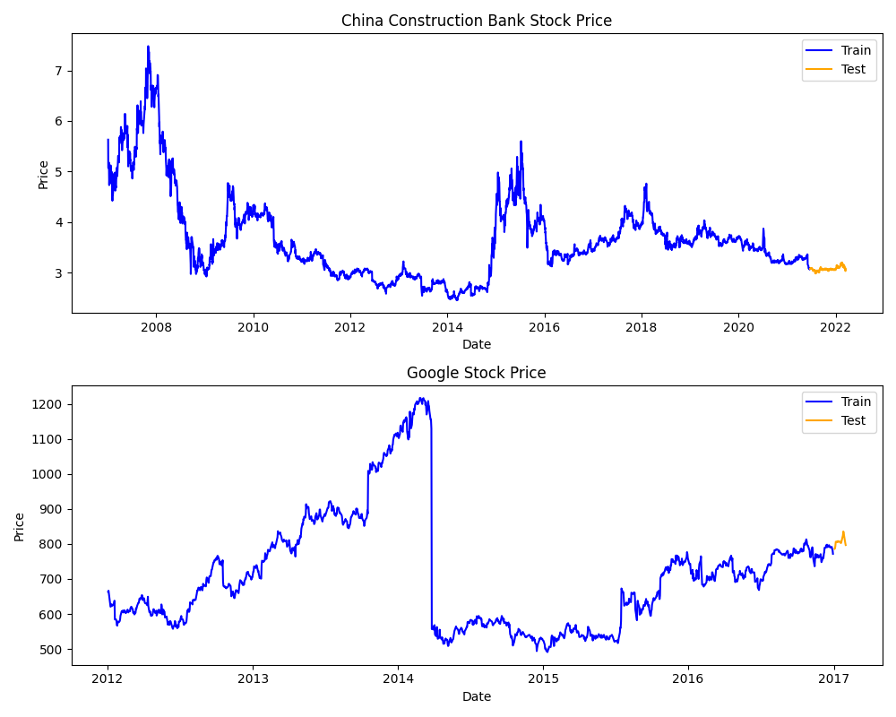
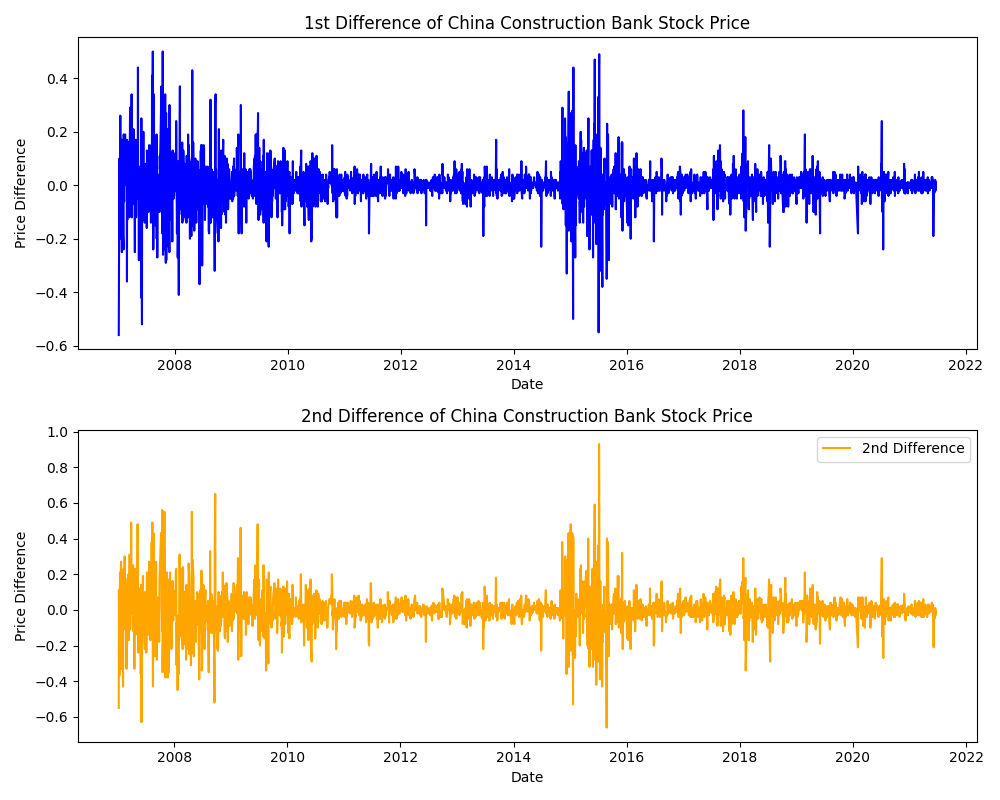
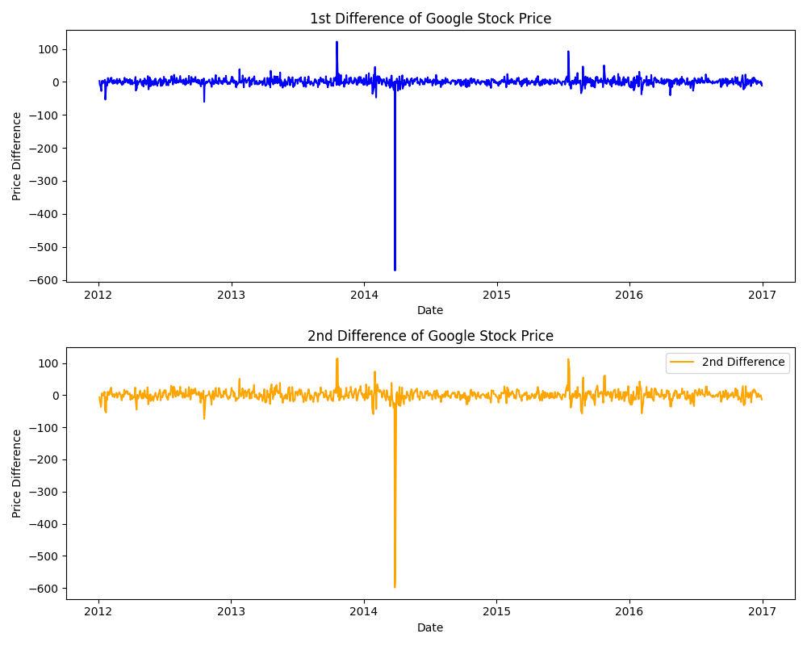

# Attention_based_CNN_LSTM_XGBoost_hybrid_model
 
**Attention-based CNN-LSTM and XGBoost hybrid model for stock prediction** という論文で提案されたモデルをPytorchで実装したものです。

使用したデータセット

- Gooogle Stock Price

- the stock price of Back of China (601988.SH) in Chinese stock market

上記のデータに1次と２次の差分処理を施したグラフ

## ADF検定の結果

601988.SHの元データに対してADF検定を実行した結果

| Metric                     | Value                          |
|--------------------------|-----------------------------|
| ADF Statistic            | -2.4785470954805904         |
| p-value                 | 0.12078167977828946         |
| 使用ラグ数 (usedlag)     | 20                          |
| 有効観測数 (nobs)       | 3660                        |
| 臨界値 (1%)              | -3.432137948707262          |
| 臨界値 (5%)              | -2.8623300163441647         |
| 臨界値 (10%)             | -2.5671905375645734         |

601988.SHの差分に対してADF検定を実行した結果

| Metric                     | Value                          |
|--------------------------|-----------------------------|
| ADF Statistic            | -12.861434023634764         |
| p-value                 | 5.1004721432341495e-24       |
| 使用ラグ数 (usedlag)     | 19                          |
| 有効観測数 (nobs)       | 3660                        |
| 臨界値 (1%)              | -3.432137948707262          |
| 臨界値 (5%)              | -2.8623300163441647         |
| 臨界値 (10%)             | -2.5671905375645734         |

# Environment

- Python 3.10.12
- torch 2.7.1+cu126